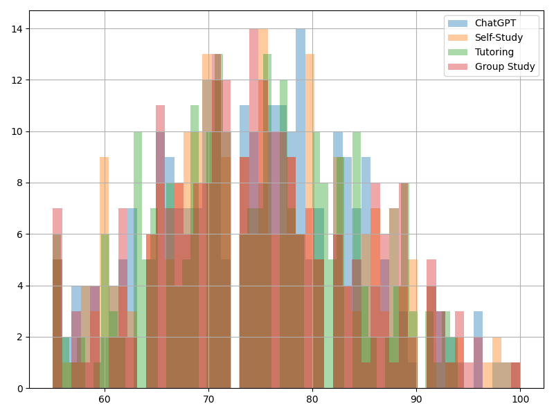
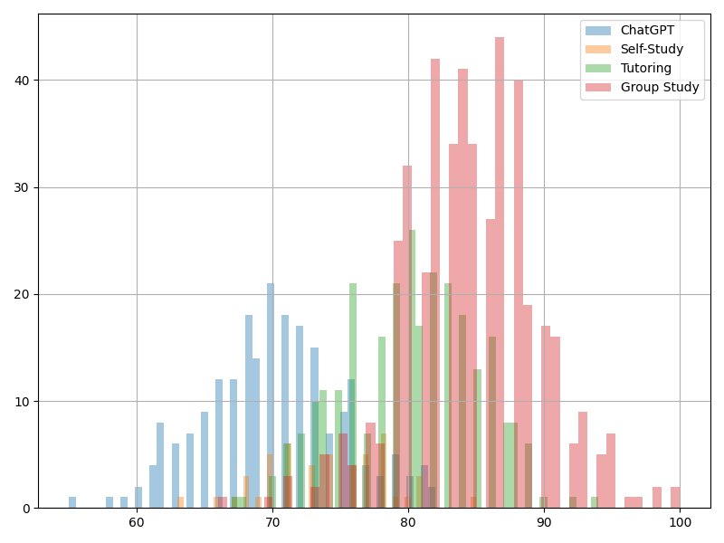
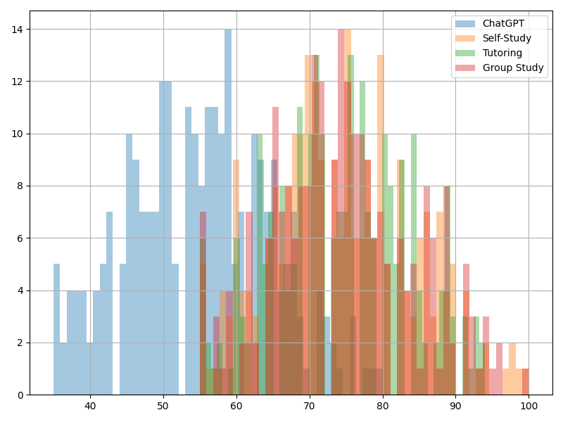
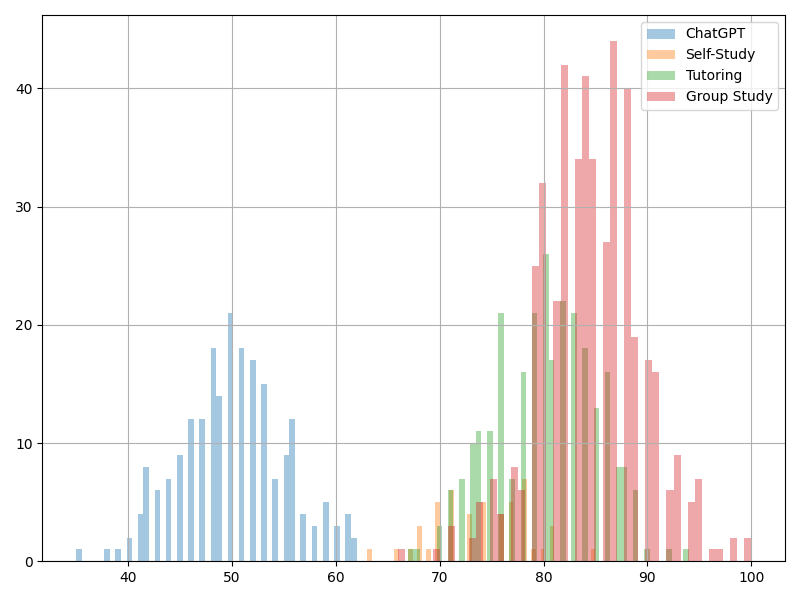

## Module 1 - ANOVA

### Data

For this assignment I generated data. Dataset is **Group Data by Study Method**, where student studied in different
method and got their test scores. In first subset student got score form the same distribution and in the other each group
got different distribution. In practice, I used normal distribution with different mean values.

### Similar score:

### Different score:

To practice post hoc I created two additional datasets where only one grop is modified:
### Similar score - One special:

### Different score - One special:

## Running ANOVA

For python implementation please refer to: `module_1/anova.py`.

Test on these two datasets reveal the expected - no relation between categorical variable and numerical: \
`0.96: No significant difference between study methods.` \
`0.00: The study method significantly affects test scores.`

## Running Tukey HSDT

Here we compare each group to other and try identify relation between each group.
As above, `p-value=0.05` for rejecting null hypothesis. 

### "Similar score"
No rejection at all, so case pairs preform the same.

| Group 1     | Group 2     | Mean Diff | p-Adj  | Lower  | Upper  | Reject |
|------------|------------|-----------|--------|--------|--------|--------|
| ChatGPT    | Group Study | -0.0744  | 0.9998 | -2.2591 | 2.1103 | False  |
| ChatGPT    | Self-Study  | -0.3684  | 0.9722 | -2.5416 | 1.8048 | False  |
| ChatGPT    | Tutoring    | -0.3692  | 0.973  | -2.5683 | 1.8299 | False  |
| Group Study| Self-Study  | -0.294   | 0.9865 | -2.52   | 1.9321 | False  |
| Group Study| Tutoring    | -0.2948  | 0.9868 | -2.5462 | 1.9566 | False  |
| Self-Study | Tutoring    | -0.0008  | 1.0000 | -2.241  | 2.2394 | False  |

### "Different score"
Only rejection, so there is no similar behaviour within pairs.

| Group 1     | Group 2     | Mean Diff | p-Adj  | Lower   | Upper   | Reject |
|------------|------------|-----------|--------|---------|---------|--------|
| ChatGPT    | Group Study | 14.4936  | 0.0    | 13.4435 | 15.5438 | True   |
| ChatGPT    | Self-Study  | 3.9868   | 0.0    | 1.9725  | 6.0011  | True   |
| ChatGPT    | Tutoring    | 10.1197  | 0.0    | 8.9595  | 11.2800 | True   |
| Group Study| Self-Study  | -10.5068 | 0.0    | -12.4184| -8.5953 | True   |
| Group Study| Tutoring    | -4.3739  | 0.0    | -5.3449 | -3.4029 | True   |
| Self-Study | Tutoring    | 6.1329   | 0.0    | 4.1587  | 8.1071  | True   |

### "Similar score - One special"
`ChatGPT` stands out, so we do not reject null hypothesis for it and other groups.

| Group 1     | Group 2     | Mean Diff | p-Adj  | Lower   | Upper   | Reject |
|------------|------------|-----------|--------|---------|---------|--------|
| ChatGPT    | Group Study | 19.9256  | 0.0    | 17.7409 | 22.1103 | True   |
| ChatGPT    | Self-Study  | 19.6316  | 0.0    | 17.4584 | 21.8048 | True   |
| ChatGPT    | Tutoring    | 19.6308  | 0.0    | 17.4317 | 21.8299 | True   |
| Group Study| Self-Study  | -0.2940  | 0.9865 | -2.5200 | 1.9321  | False  |
| Group Study| Tutoring    | -0.2948  | 0.9868 | -2.5462 | 1.9566  | False  |
| Self-Study | Tutoring    | -0.0008  | 1.0    | -2.2410 | 2.2394  | False  |

### "Different score - One special"
Despite that `ChatGPT` group stands out, all other groups are unique, so each pair is different.

| Group 1     | Group 2     | Mean Diff | p-Adj  | Lower   | Upper   | Reject |
|------------|------------|-----------|--------|---------|---------|--------|
| ChatGPT    | Group Study | 34.4936  | 0.0    | 33.4435 | 35.5438 | True   |
| ChatGPT    | Self-Study  | 23.9868  | 0.0    | 21.9725 | 26.0011 | True   |
| ChatGPT    | Tutoring    | 30.1197  | 0.0    | 28.9595 | 31.2800 | True   |
| Group Study| Self-Study  | -10.5068 | 0.0    | -12.4184| -8.5953 | True   |
| Group Study| Tutoring    | -4.3739  | 0.0    | -5.3449 | -3.4029 | True   |
| Self-Study | Tutoring    | 6.1329   | 0.0    | 4.1587  | 8.1071  | True   |