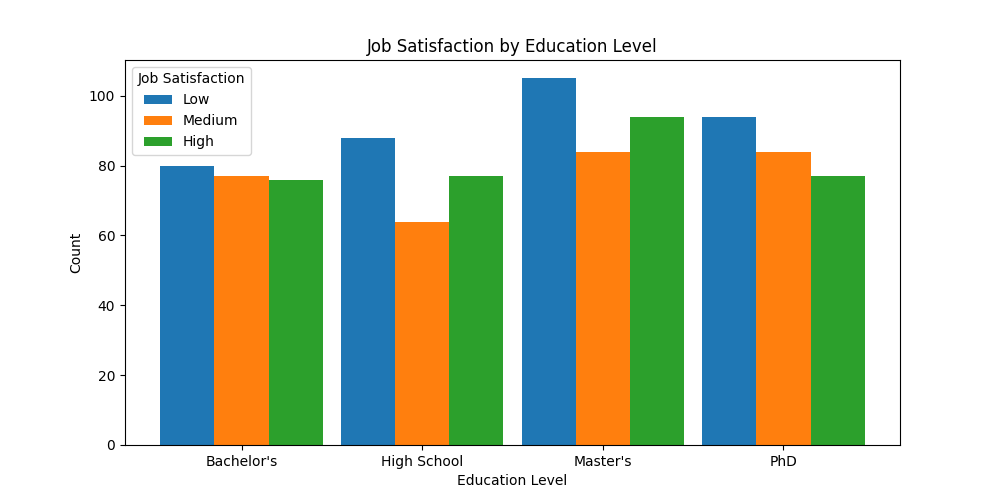
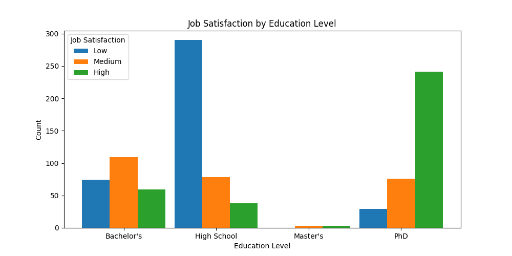

## Chi Square test

### Data

For this assignment I generated two dataset. Dataset is **Job satisfaction as an education level**, where people where 
asked about their job satisfaction and their educational level. In first dataset there is no creation between two,
and in other satisfaction progresses as an education level. Recall, that data is generated so results may vary from 
expected due to random nature and relatively small sample size (1000).

### Balanced:

### Unbalanced:

## Running Chi Square test

For python implementation please refer to: `module_2/chi_square.py`.

Test on these two datasets reveal the expected - no relation between categorical variable and numerical: \
`0.86: No effect of education level to job satisfaction.` \
`0.00: Education level has an effect to job satisfaction.`

## Running Post Hoc

Here we compare each group to other and try identify relation between each group.
As above, `p-value=0.05` for rejecting null hypothesis. 

### "Balanced"
No rejection at all, so case pairs preform the same.

| Comparison              | Raw p-value | Reject Null Hypothesis |
|-------------------------|-------------|-------------------------|
| PhD vs High School      | 0.4704      | False                  |
| PhD vs Master's         | 0.6560      | False                  |
| PhD vs Bachelor's       | 0.7999      | False                  |
| High School vs Master's | 0.9062      | False                  |
| High School vs Bachelor's | 0.4603    | False                  |
| Master's vs Bachelor's  | 0.6871      | False                  |

### "Unbalanced"
There is a variety between groups. Mostly by comparison of `Master's` due to it small sample size.

| Comparison                | Raw p-value | Reject Null Hypothesis |
|---------------------------|-------------|-------------------------|
| High School vs Bachelor's | 0.0000      | True                    |
| High School vs Master's   | 0.0002      | True                    |
| High School vs PhD        | 0.0000      | True                    |
| Bachelor's vs Master's    | 0.1823      | False                   |
| Bachelor's vs PhD         | 0.0000      | True                    |
| Master's vs PhD           | 0.2349      | False                   |
