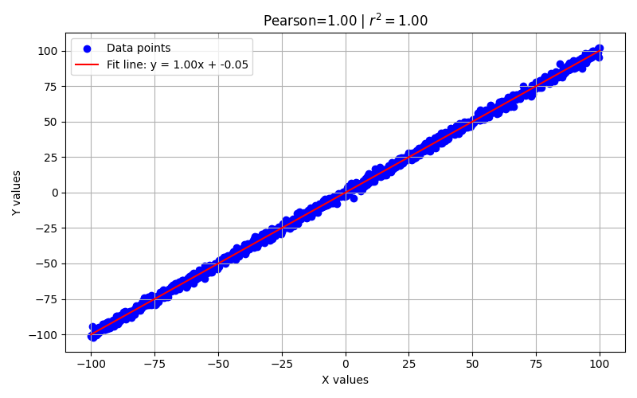
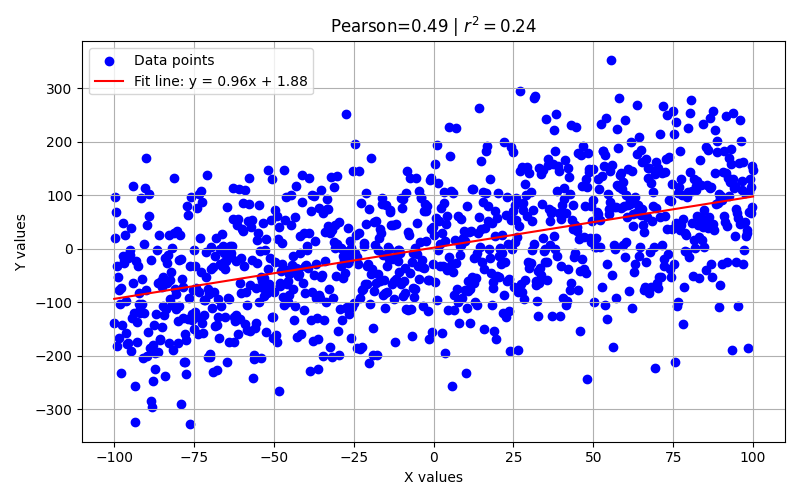
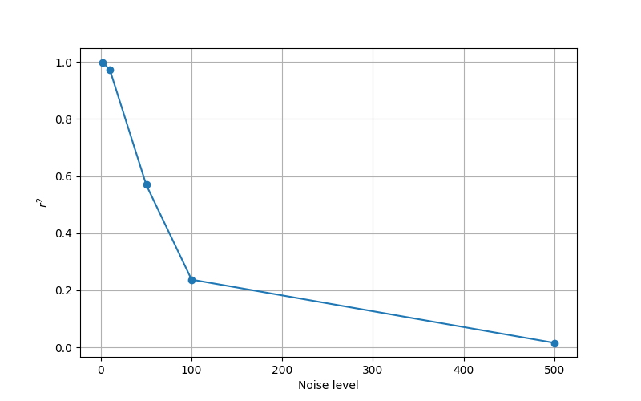

## Pearson

### Data

For this assignment I generated data. Dataset is based on **Noise level**($\sigma$) and **Relation factor** (a), i.e. I
tested
efficiency of the method based on linear relation type and noise. The formula:
$y=x+a\cdot N(0,\sigma)$
Each set consists of 1000 samples. Values range:

- Noise levels ($\sigma$): `[2, 10, 50, 100, 500]`
- Relation factor: `[-5, -1, 0, 1, 5]`

### $\sigma = 2, a=-5$:

### $\sigma = 100, a=-1$:

## Relation between $r^2$ and $\sigma$

Relation between noise level and $r^2$ is expected to be:
$r^2 = \frac{a^2}{a^2 + \sigma^2}$

We can track it from our results:
